<div align="center">

<!-- ══════════════════════════════════════════════════
     ANIMATED HEADER WAVE — twinkling star effect
═══════════════════════════════════════════════════ -->


<br/>

<!-- ══════════════════════════════════════════════════
     ANIMATED TYPING ROLES
═══════════════════════════════════════════════════ -->


<br/><br/>

<!-- ══════════════════════════════════════════════════
     SOCIAL BADGES
═══════════════════════════════════════════════════ -->

<a href="mailto:adarsh.r.s.pal@gmail.com">
  
</a>&nbsp;
<a href="https://www.linkedin.com/in/adarsh-pal-11212b292">
  
</a>&nbsp;
<a href="https://www.adarshpal.me/">
  
</a>&nbsp;
<a href="https://www.instagram.com/_adarsh.pal">
  
</a>&nbsp;
<a href="https://github.com/pal-adarsh">
  
</a>

<br/><br/>

<!-- ══════════════════════════════════════════════════
     ANIMATED METRIC BADGES
═══════════════════════════════════════════════════ -->


&nbsp;

&nbsp;


</div>

<br/>

---

### <samp>◤ 01 — BASE_CAMP</samp>

<table width="100%">
<tr>

<td width="58%" valign="top">

```yaml
📍 Location    : Mumbai, India 🇮🇳
🎓 Education   : Computer Engineering — LTCoE, Mumbai University (Final Year)
💼 Role        : Full Stack Developer | Open Source Enthusiast

🔭 Currently :
   - 🧩 Sharpening DSA for campus placements
   - 🤖 Exploring AI Agents & LLM Integrations
   - 🏗️ Shipping production apps with Next.js & Supabase

🌿 Outside Code :
   - 🥾 Trekking mountain trails
   - 🌱 Growing plants & exploring nature
   - 🗺️ Traveling to unexplored places

💬 Ask Me About :
   - React, Next.js & TypeScript
   - Full Stack Development (Node.js, Supabase, Clerk)
   - AI-integrated products
   - Python & DSA
   - Open Source
```

</td>

<td width="42%" align="center" valign="top">


<br/><br/>

```text
▲ "The sky is NOT the
   limit — it's just
   the beginning."
```

</td>

</tr>
</table>

<br/>

<div align="center">


</div>

---

##  Tech Stack

<div align="center">

### 🌐 Frontend


<br/>

### ⚙️ Backend & Databases


<br/>

### 🧰 Languages & Tools


</div>

<br/>

---

##  GitHub Stats

<!--
  These cards are generated by GitHub Actions and committed to /profile in this
  repo, instead of pointing at the public github-readme-stats.vercel.app /
  streak-stats.demolab.com instances. Both of those public endpoints have had
  repeated outages — self-hosting via Actions means these never show a broken
  image. See .github/workflows/profile-stats.yml and streak-stats.yml.
-->

<div align="center">

<table>
  <tr>
    <td width="50%">
      
    </td>
    <td width="50%">
      
    </td>
  </tr>
</table>

<br/>



</div>

<br/>

---


## 📈 Contribution Graph

<div align="center">


</div>

---

## 🏆 GitHub Trophies

<div align="center">
  
</div>

<br/>

---

## 🎯 Current Focus

<div align="center">

| 🎯 Area | 💡 Status | 🔥 Progress |
|:--------|:----------|:-----------|
| 🧩 Data Structures & Algorithms | `Active` |  |
| 🤖 AI-Integrated Products | `Building` |  |
| ⚛️ Next.js Full Stack | `Shipping` |  |
| 🎓 Campus Placements | `Preparing` |  |

</div>

<br/>

---

## 🤝 Open To Collaborate On

<div align="center">

<table>
  <tr>
    <td align="center">
      <br/><sub>Next.js · Node · Supabase</sub>
    </td>
    <td align="center">
      <br/><sub>LLM APIs · Automation</sub>
    </td>
    <td align="center">
      <br/><sub>Three.js · WebGL · Creative UI</sub>
    </td>
    <td align="center">
      <br/><sub>Indian Market Problems</sub>
    </td>
  </tr>
</table>

</div>

<br/>

---

## ✨ Beyond The Code


- 🥾 **Mountain Trekker** — trails feel like home
- 🌿 **Plant Parent** — 20+ plants and counting
- 🌍 **Wanderlust** — always planning the next adventure  
- 🧠 **Fun fact** — I debug best on hikes 😄
- 🔥 **Superpower** — Making any project look aesthetic

<br clear="right"/>

---

## 🐍 Watch the Snake Eat My Contributions

<div align="center">

<picture>
  <source
    media="(prefers-color-scheme: dark)"
    srcset="https://raw.githubusercontent.com/pal-adarsh/pal-adarsh/output/github-contribution-grid-snake-dark.svg"
  />
  <source
    media="(prefers-color-scheme: light)"
    srcset="https://raw.githubusercontent.com/pal-adarsh/pal-adarsh/output/github-contribution-grid-snake.svg"
  />
  
</picture>

</div>

---


## 💭 Words I Live By

<div align="center">


</div>

<br/>

---

<div align="center">

*✨ Thanks for stopping by! Drop a ⭐ if something caught your eye!*

<br/>


<br/><br/>


</div>