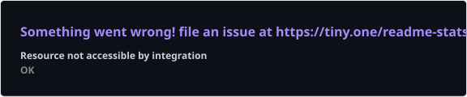

<div align="center">

<!-- ═══════════════════════════ HEADER ═══════════════════════════ -->


<!-- ═══════════════════════ TYPING ROLES ═══════════════════════ -->


<br/>

<!-- ═══════════════════════ SOCIAL BADGES ═══════════════════════ -->

<a href="https://www.adarshpal.me/"></a>
<a href="https://www.linkedin.com/in/adarsh-pal-11212b292"></a>
<a href="mailto:adarsh.r.s.pal@gmail.com"></a>
<a href="https://www.instagram.com/_adarsh.pal"></a>
<a href="https://github.com/pal-adarsh"></a>

<br/><br/>


</div>

<br/>


<br/>

<!-- ═══════════════════════════ CHAPTER 01 ═══════════════════════════ -->

<div align="center">

</div>

<br/>

<table width="100%">
<tr>

<td width="60%" valign="top">

```yaml
📍 Location   : Mumbai, India 🇮🇳
🎓 Education  : B.E. Computer Engineering — LTCoE, Mumbai University (Final Year)
💼 Role       : Full Stack Developer | Open Source Enthusiast

🔭 Right now  :
   - 🧩 Sharpening DSA for campus placements
   - 🤖 Building with AI agents & LLM integrations
   - 🏗️ Shipping production apps with Next.js & Supabase

🌿 Off-screen :
   - 🥾 Trekking mountain trails
   - 🌱 20+ plants and counting
   - 🗺️ Chasing unexplored places

💬 Ask me about:
   - React, Next.js & TypeScript
   - Full stack (Node.js, Supabase, Clerk)
   - AI-integrated products
   - Python & DSA
```

</td>

<td width="40%" align="center" valign="middle">


<br/><br/>

> *"The sky is NOT the limit —*
> *it's just the beginning."*

</td>

</tr>
</table>

<br/>

<!-- ═══════════════════════ CHAPTER 02 ═══════════════════════ -->

<div align="center">

</div>

<br/>

<div align="center">

<table>
<tr>
<td align="center" width="25%">
<br/>
<b>CSI Club</b><br/><sub>LTCoE</sub>
</td>
<td align="center" width="25%">
<br/>
<b>CESA</b><br/><sub>Computer Engineering Student Association</sub>
</td>
<td align="center" width="25%">
<br/>
<b>GDG On-Campus</b><br/><sub>LTCoE</sub>
</td>
<td align="center" width="25%">
<br/>
<b>Zephyr Fest 2026</b><br/><sub>LTCoE</sub>
</td>
</tr>
</table>

<sub>Also Social Media Coordinator at IIC Club.</sub>

</div>

<br/>

<!-- ═══════════════════════ CHAPTER 03 ═══════════════════════ -->

<div align="center">

</div>

<br/>

<div align="center">

<br/>


<br/><br/>

<br/>


<br/><br/>

<br/>


</div>

<br/>

<!-- ═══════════════════════ CHAPTER 04 ═══════════════════════ -->

<div align="center">

</div>

<br/>

<!--
  Cards are generated by GitHub Actions and committed to /profile in this repo,
  so they never break when the public stats servers go down.
  See .github/workflows/profile-stats.yml and streak-stats.yml.
-->

<div align="center">

<table>
  <tr>
    <td width="50%">
      
    </td>
    <td width="50%">
      
    </td>
  </tr>
</table>

<br/>



<br/><br/>


</div>

<br/>

<!-- ═══════════════════════ CHAPTER 05 ═══════════════════════ -->

<div align="center">

</div>

<br/>

<div align="center">

| 🎯 Mission | 📡 Status | 📝 What that means |
|:-----------|:----------|:-------------------|
| 🧩 **DSA** |  | Daily practice for campus placements |
| 🤖 **AI Products** |  | LLM integrations & agents in real apps |
| ⚛️ **Next.js Full Stack** |  | Production apps on Next.js + Supabase |
| 🎓 **Placements** |  | Open to SDE / Full Stack roles |

</div>

<br/>

<!-- ═══════════════════════ CHAPTER 06 ═══════════════════════ -->

<div align="center">

</div>

<br/>

<div align="center">

<table>
  <tr>
    <td align="center">
      <br/><sub>Next.js · Node · Supabase</sub>
    </td>
    <td align="center">
      <br/><sub>LLM APIs · Automation</sub>
    </td>
    <td align="center">
      <br/><sub>Three.js · WebGL · Creative UI</sub>
    </td>
    <td align="center">
      <br/><sub>Indian Market Problems</sub>
    </td>
  </tr>
</table>

</div>

<br/>

<!-- ═══════════════════════ CHAPTER 07 ═══════════════════════ -->

<div align="center">

</div>

<br/>


- 🥾 **Mountain Trekker** — trails feel like home
- 🌿 **Plant Parent** — 20+ plants and counting
- 🌍 **Wanderlust** — always planning the next adventure
- 🧠 **Fun fact** — I debug best on hikes 😄
- 🔥 **Superpower** — making any project look aesthetic

<br clear="right"/>

<br/>

<!-- ═══════════════════════ CHAPTER 08 ═══════════════════════ -->

<div align="center">

</div>

<br/>

<div align="center">

<picture>
  <source
    media="(prefers-color-scheme: dark)"
    srcset="https://raw.githubusercontent.com/pal-adarsh/pal-adarsh/output/github-contribution-grid-snake-dark.svg"
  />
  <source
    media="(prefers-color-scheme: light)"
    srcset="https://raw.githubusercontent.com/pal-adarsh/pal-adarsh/output/github-contribution-grid-snake.svg"
  />
  
</picture>

</div>

<br/>


<br/>

<!-- ═══════════════════════ QUOTES + FOOTER ═══════════════════════ -->

<div align="center">


<br/><br/>

<a href="mailto:adarsh.r.s.pal@gmail.com">
  
</a>

<br/><br/>

<sub>📖 <i>End of Chapter 08 — more chapters shipping soon.</i></sub>

<br/>

<sub>✨ Thanks for stopping by — drop a ⭐ if something caught your eye!</sub>


</div>
